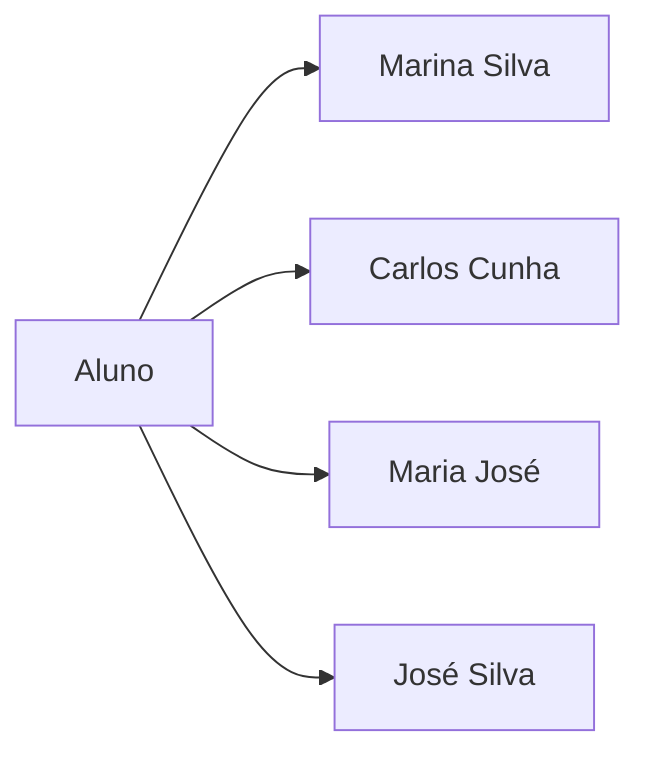
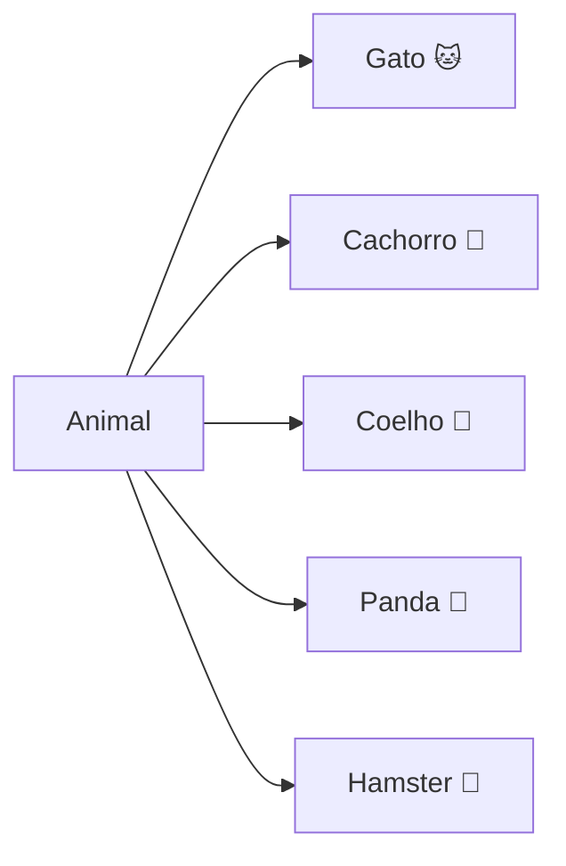
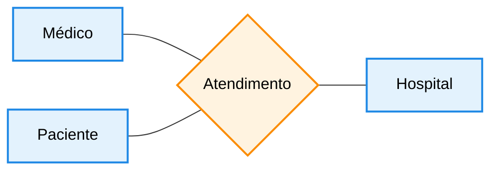
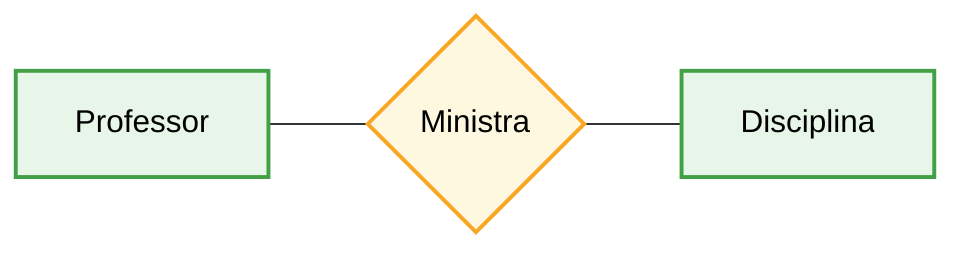
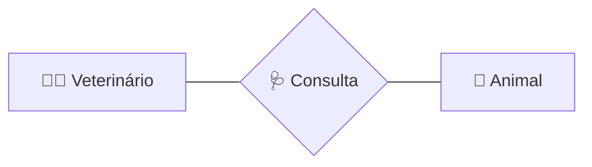
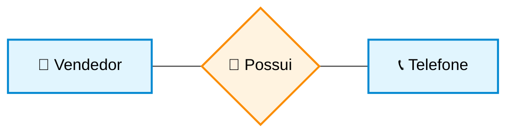
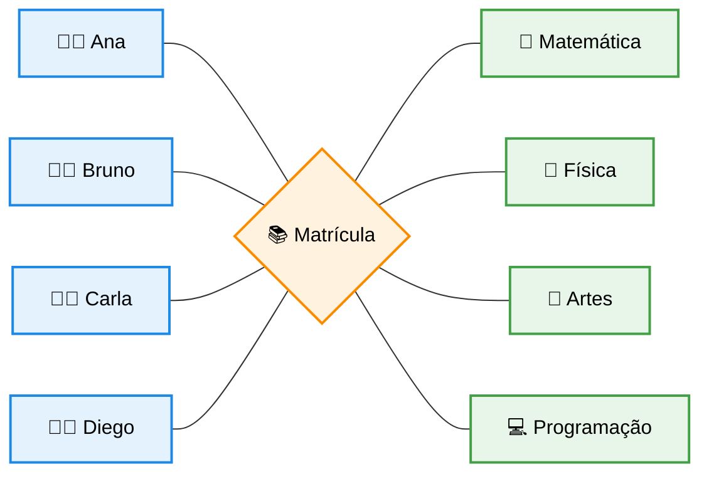
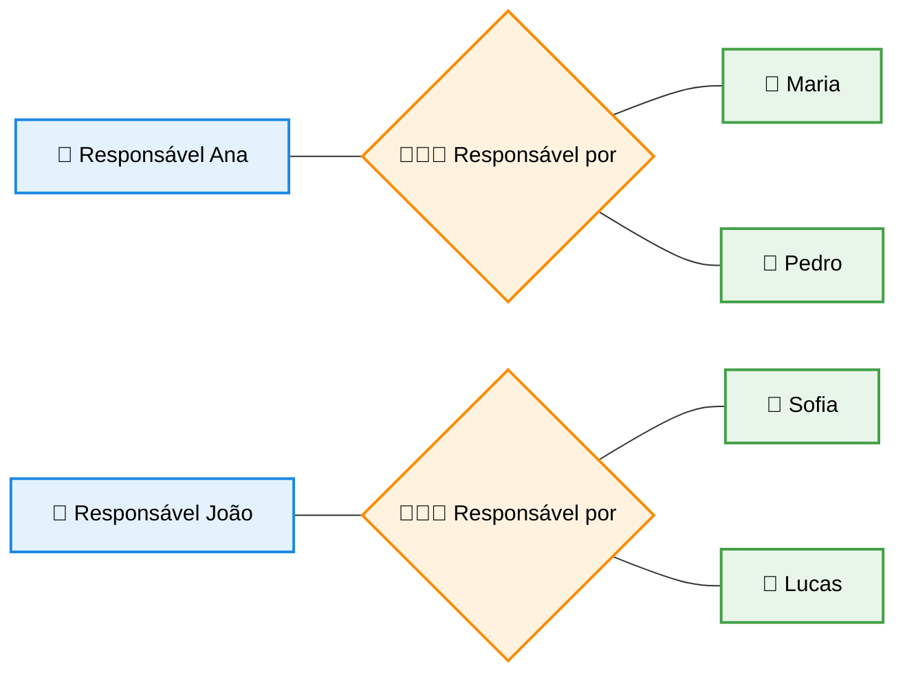

## Entidades

As entidades são os principais elementos da modelagem Entidade-Relacionamento. Elas representam coisas do mundo real sobre as quais queremos guardar informações.

Uma entidade pode ser uma pessoa, um objeto, um lugar ou até mesmo um conceito. O importante é que ela possa ser identificada e descrita dentro do sistema.

De forma simples, pense assim: **entidade é tudo aquilo que você quer cadastrar no sistema**.

Por exemplo, em um sistema de hospital, algumas entidades podem ser **Médicos** e **Pacientes**, pois queremos armazenar informações sobre eles e entender como eles se relacionam (como atendimentos, consultas, etc.).

## Exemplos de entidade e instâncias

 
 

##

## Relacionamentos

 

## Cardinalidade: Relacionamento 1:1 (Um para Um)

Um relacionamento **um para um (1:1)** ocorre quando cada instância de uma entidade está associada a apenas uma instância de outra entidade, e vice-versa.

- Cada **🧑 pessoa** possui **📞 um telefone**
- Cada **📞 telefone** pertence a **🧑 uma pessoa**

👉 Ou seja:  
**1 pessoa ⇄ 1 telefone**

> [!CAUTELA]
> Avalie cada regra de negócios. Hoje em dia cada pessoa pode possuir mais do que um telefone, mas para este exemplo o relacionamento era de 1:1.

### Exemplo: Pessoa e Telefone

## Cardinalidade: Relacionamento Muitos para Muitos (M:N)

## Cardinalidade: Relacionamento Um para Muitos (1:N)

