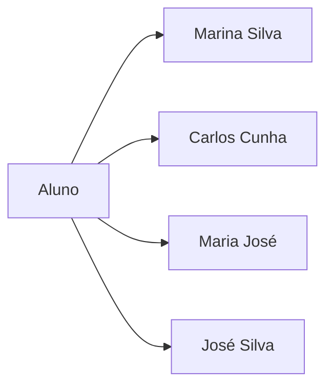
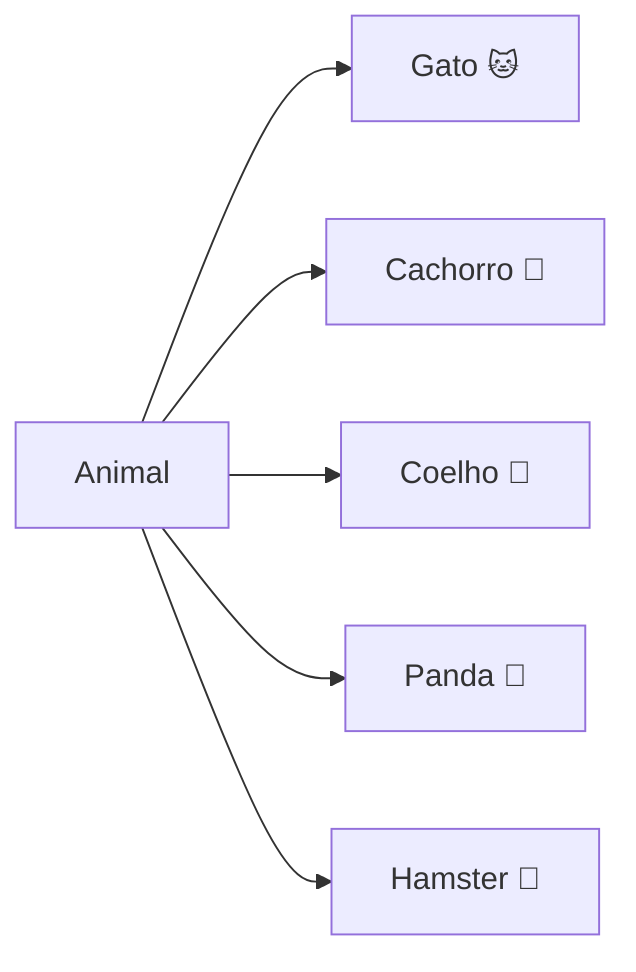
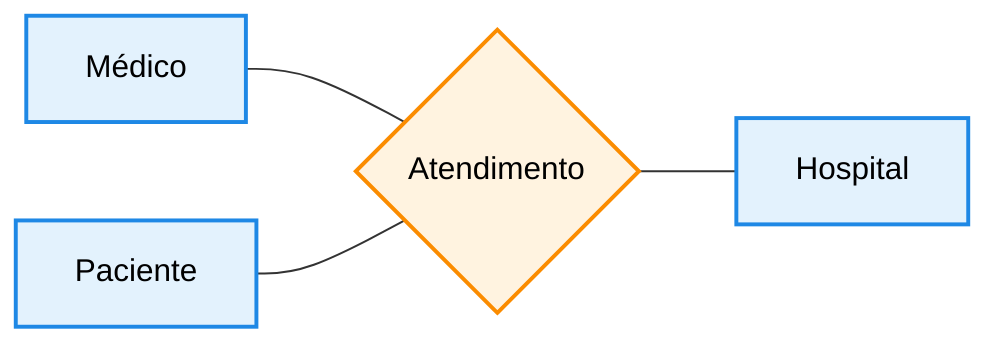
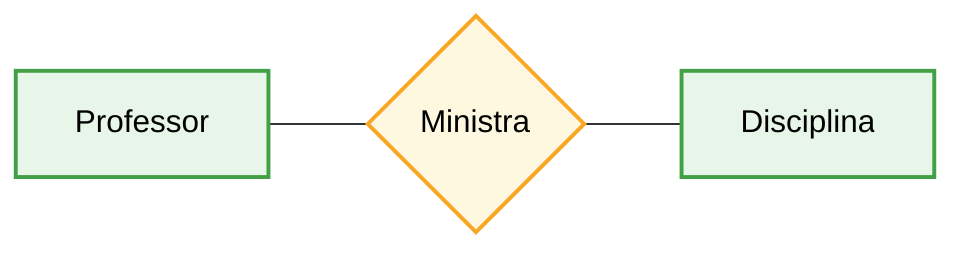
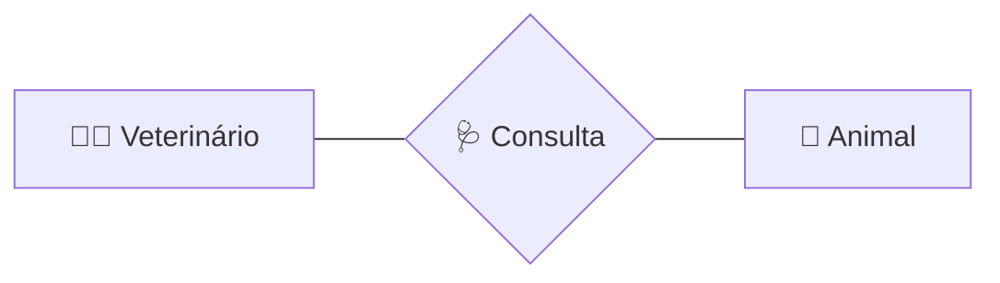

## Entidades

As entidades são os principais elementos da modelagem Entidade-Relacionamento. Elas representam coisas do mundo real sobre as quais queremos guardar informações.

Uma entidade pode ser uma pessoa, um objeto, um lugar ou até mesmo um conceito. O importante é que ela possa ser identificada e descrita dentro do sistema.

De forma simples, pense assim: **entidade é tudo aquilo que você quer cadastrar no sistema**.

Por exemplo, em um sistema de hospital, algumas entidades podem ser **Médicos** e **Pacientes**, pois queremos armazenar informações sobre eles e entender como eles se relacionam (como atendimentos, consultas, etc.).

## Exemplos de entidade e instâncias

 
 

##

## Relacionamentos

 

