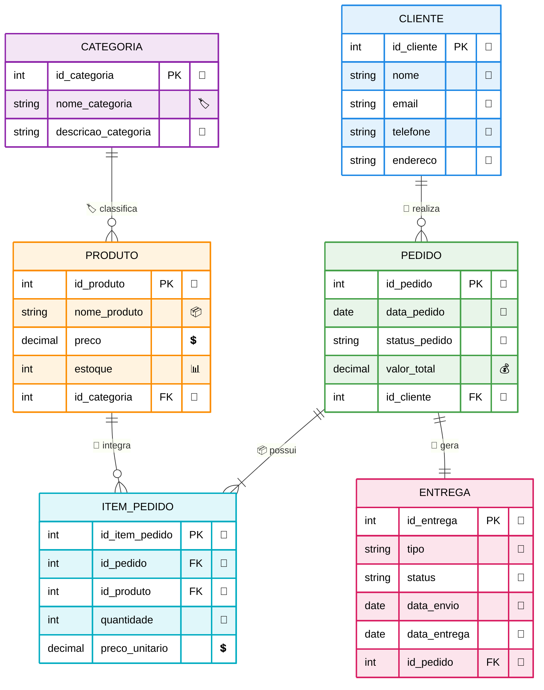

```mermaid
erDiagram

    CLIENTE {
        int id_cliente PK "🔑"
        string nome "📝"
        string email "📧"
        string telefone "📱"
        string endereco "📍"
    }

    PEDIDO {
        int id_pedido PK "🔑"
        date data_pedido "📅"
        string status_pedido "📌"
        decimal valor_total "💰"
        int id_cliente FK "🔗"
    }

    PRODUTO {
        int id_produto PK "🔑"
        string nome_produto "📦"
        decimal preco "💲"
        int estoque "📊"
        int id_categoria FK "🔗"
    }

    CATEGORIA {
        int id_categoria PK "🔑"
        string nome_categoria "🏷️"
        string descricao_categoria "📝"
    }

    ITEM_PEDIDO {
        int id_item_pedido PK "🔑"
        int id_pedido FK "🔗"
        int id_produto FK "🔗"
        int quantidade "🔢"
        decimal preco_unitario "💲"
    }

    ENTREGA {
        int id_entrega PK "🔑"
        string tipo "🚚"
        string status "📌"
        date data_envio "📅"
        date data_entrega "📅"
        int id_pedido FK "🔗"
    }

    CLIENTE ||--o{ PEDIDO : "🛒 realiza"
    PEDIDO ||--|{ ITEM_PEDIDO : "📦 possui"
    PRODUTO ||--o{ ITEM_PEDIDO : "🔗 integra"
    CATEGORIA ||--o{ PRODUTO : "🏷️ classifica"
    PEDIDO ||--|| ENTREGA : "🚚 gera"

%% ===================== CORES + TEXTO PRETO =====================
    style CLIENTE fill:#E3F2FD,stroke:#1E88E5,stroke-width:2px,color:#000
    style PEDIDO fill:#E8F5E9,stroke:#43A047,stroke-width:2px,color:#000
    style PRODUTO fill:#FFF3E0,stroke:#FB8C00,stroke-width:2px,color:#000
    style CATEGORIA fill:#F3E5F5,stroke:#8E24AA,stroke-width:2px,color:#000
    style ITEM_PEDIDO fill:#E0F7FA,stroke:#00ACC1,stroke-width:2px,color:#000
    style ENTREGA fill:#FCE4EC,stroke:#D81B60,stroke-width:2px,color:#000
```

