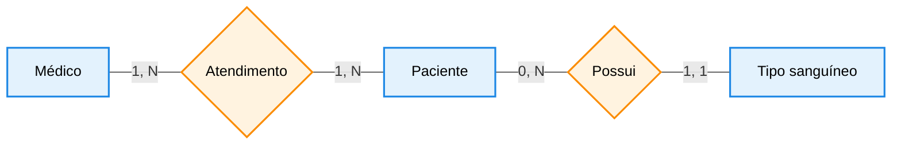

# ModelagemDados

```mermaid
flowchart LR

    MEDICO["Médico"]
    PACIENTE["Paciente"]
    TIPO_SANGUINEO["Tipo sanguíneo"]

    ATENDIMENTO{"Atendimento"}
    POSSUI{"Possui"}

    MEDICO ---|"1, N"| ATENDIMENTO
    ATENDIMENTO ---|"1, N"| PACIENTE

    PACIENTE ---|"0, N"| POSSUI
    POSSUI ---|"1, 1"| TIPO_SANGUINEO

    classDef entidade fill:#E3F2FD,stroke:#1E88E5,stroke-width:2px,color:#000;
    classDef relacionamento fill:#FFF3E0,stroke:#FB8C00,stroke-width:2px,color:#000;

    class MEDICO,PACIENTE,TIPO_SANGUINEO entidade;
    class ATENDIMENTO,POSSUI relacionamento;
```