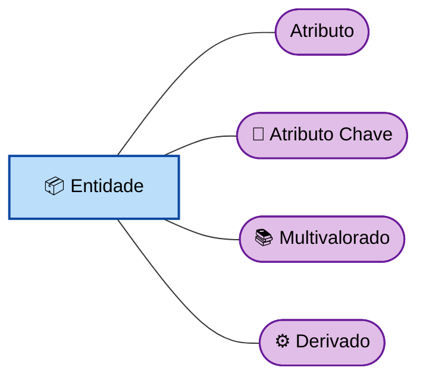
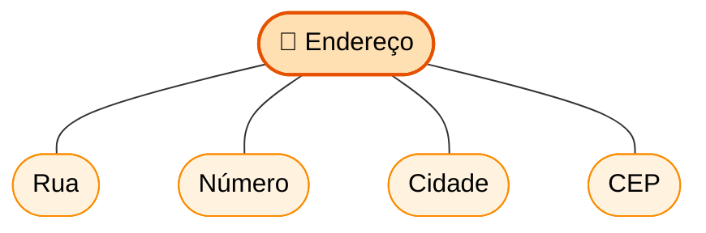
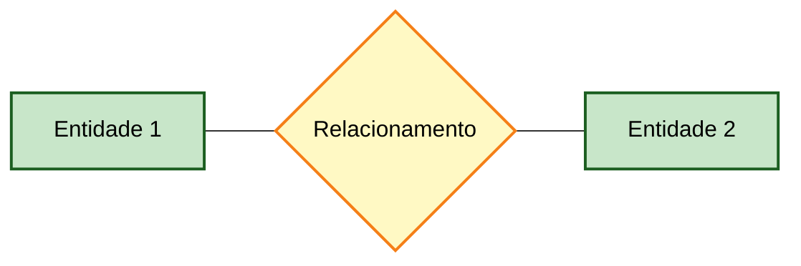
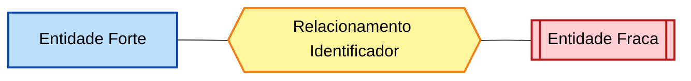
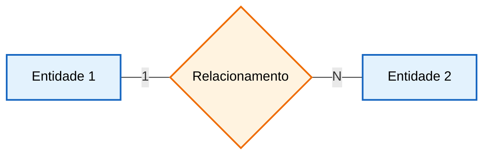
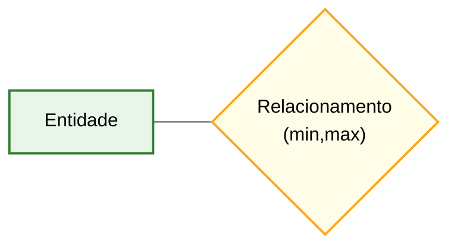

# 📘 Descrição detalhada dos elementos do DER (Modelo Chen)

## 🔷 Entidade

A entidade representa um objeto do mundo real (físico ou abstrato) sobre o qual desejamos armazenar informações. Pode ser uma pessoa, lugar, evento ou conceito. Cada entidade possui um conjunto de atributos que descrevem suas características.

---

## 🔷 Entidade fraca

A entidade fraca é aquela que não possui uma chave primária própria suficiente para identificá-la unicamente. Sua existência depende de uma entidade forte, sendo identificada por meio de um relacionamento com esta, geralmente chamado de relacionamento identificador.

---

## 🔷 Relacionamento

O relacionamento representa a associação entre duas ou mais entidades. Ele indica como os dados de uma entidade estão conectados com os de outra no contexto do sistema.

---

## 🔷 Relacionamento identificador

É um tipo especial de relacionamento que vincula uma entidade fraca à sua entidade forte. Ele é responsável por garantir a identificação única da entidade fraca, complementando sua chave.

---

## 🔷 Atributo

O atributo corresponde a uma propriedade ou característica de uma entidade ou relacionamento. Ele descreve detalhes específicos, como nome, idade, data ou valor.

---

## 🔷 Atributo chave

É o atributo (ou conjunto de atributos) responsável por identificar de forma única cada instância de uma entidade. Também é conhecido como chave primária.

---

## 🔷 Atributo multivalorado

Representa um atributo que pode possuir múltiplos valores para uma mesma entidade. Por exemplo, uma pessoa pode ter vários números de telefone.

---

## 🔷 Atributo derivado

É um atributo cujo valor pode ser calculado a partir de outros atributos. Ele não precisa ser armazenado diretamente no banco de dados, pois pode ser obtido por meio de processamento.

---

## 🔷 Atributo composto

É um atributo que pode ser subdividido em partes menores, cada uma com significado próprio. Por exemplo, um endereço pode ser composto por rua, número, cidade e CEP.

---

## 🔷 Participação total

Indica que todas as instâncias de uma entidade participam obrigatoriamente de um relacionamento. Ou seja, não pode existir uma ocorrência da entidade sem estar associada ao relacionamento.

---

## 🔷 Cardinalidade (1:N)

Define a quantidade de ocorrências de uma entidade que podem estar relacionadas com outra. No caso 1:N, uma instância de uma entidade pode se relacionar com várias da outra, mas o inverso não ocorre.

---

## 🔷 Restrição estrutural (mín, máx)

Especifica os limites mínimo e máximo de participação de uma entidade em um relacionamento, tornando a modelagem mais precisa e controlada.

